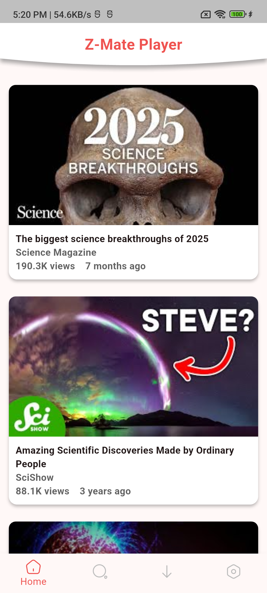
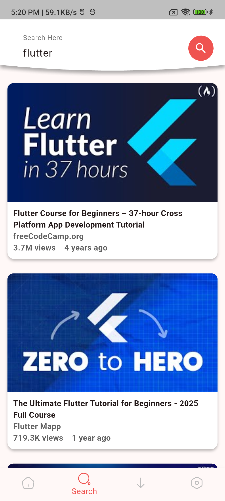
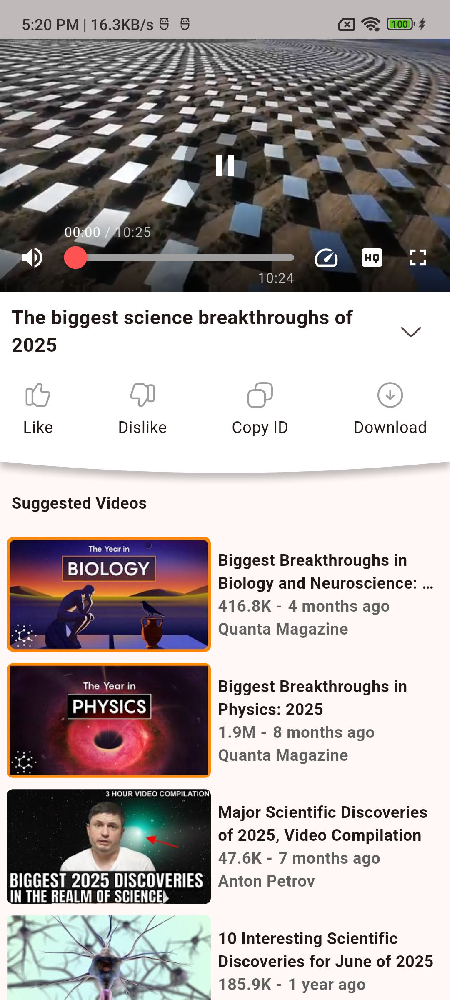
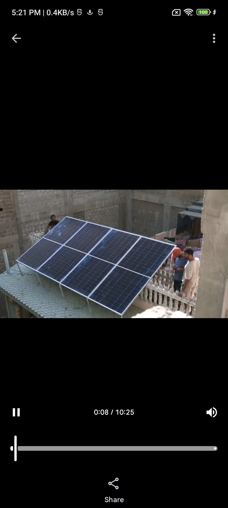
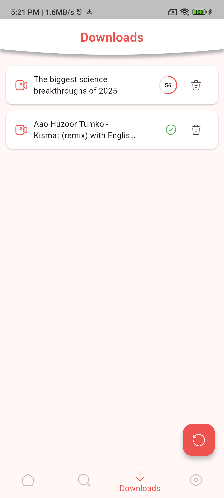

# Z-mate

**Z-mate** is a simple Flutter-based YouTube video downloader and player.

The project focuses on YouTube metadata/stream handling, background downloads, local media management, and video playback.

## ✨ Features

- 🔎 Search YouTube videos
- 🎬 View video information
- ▶️ Play videos inside the app
- 📥 Download supported muxed video streams
- 🔔 Background download notifications
- 📊 Download progress tracking
- 🗂️ Download list management
- 🗑️ Delete downloaded files
- 📱 Simple Flutter UI

## 📱 Screenshots

### Home



### Search



### Player



### Playing



### Downloads



## 🛠️ Built With

- **Flutter / Dart**
- **youtube_explode_dart** — YouTube metadata and stream information
- **flutter_downloader** — background file downloads
- **video_player** — video playback
- **Iconsax** — icons

## 🎯 Project Purpose

**Z-mate** is a simple Flutter-based YouTube video downloader and player.

```text
YouTube
   ↓
Metadata / Stream Information
   ↓
Flutter
   ↓
Background Downloader
   ↓
Local Storage
   ↓
Video Player
```

The project intentionally keeps the implementation relatively simple instead of trying to build a complete high-definition downloading system with complex stream processing.

## 📂 Project Structure

The project follows a feature-oriented structure with separate layers for presentation, domain, and data.

```text
lib/
├── core/
├── features/
│   ├── Download/
│   ├── Home/
│   ├── Player/
│   └── Search/
├── helper/
└── main.dart
```

## 🚀 Getting Started

### Requirements

- Flutter SDK
- Android Studio / Android SDK
- Android device or emulator

### Run the project

```bash
flutter pub get
flutter run
```

### Build APK

```bash
flutter build apk
```

## 📚 Educational Note

This project is intended for learning and experimentation with Flutter, background downloading, media playback, and application architecture.

Use the project responsibly and make sure you have the necessary rights to download or use any content.

## 👨‍💻 Author

**DevZam**

GitHub:

[https://github.com/itsdevzam](https://github.com/itsdevzam)

## 📄 License

This project is provided for educational purposes.
